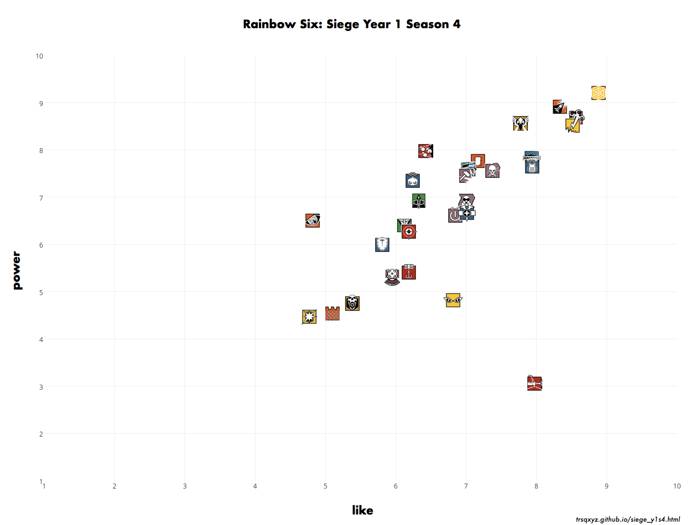

title: Rainbow Six: Siege Year 1 Season 4 オペレーター人気投票 解説
Date: 2017/02/14 11:06
save_as: siege_y1s4.html
url: siege_y1s4.html

1月20日からYear2 Seson1の開始までに行ったアンケートに関する記事です。  

UBISOFT から発売されている Rainbow Six: Siege のプレイヤーたちはどのオペレーターが好きなのだろうか。自分とはどう違うのだろうかと考えたのが今回のアンケートを作成したきっかけです。  

当初アンケートは1ヶ月ほど集計したいと考えていましたが、Operation Velvet Shell が開始して途中で認識が変わることを懸念したため、前夜の2月7日で終了しました。  
集計期間は 1月20日 - 2月7日 (19日間) 回答数は計93件でした。  
twitter アカウントやシージプレイヤーとしての注目度からするとなかなか健闘した回答数と思いますが、コミュニティに浸透しなかったため残念な件数となってしまったのが正直なところです。  

アンケートは各オペレーターごとに 好き(10) <-> 嫌い(1) と 強い(10) <-> 弱い(1) として数値を入力してもらい、平均点で算出を行いました。

## アンケート結果  

アンケート結果はこのようになりました。  
まず印象的だったのは、ほとんどのオペレーターが好まれているということでした。また、足3のオペレーターの人気、とくにイェーガーのダントツの人気っぷりがよくわかります。  
Red Crow Mid Reinforcement で Buff されたタチャンカはルークと同程度の人気でありながら、ぶっちぎりの弱さという評価でした。Velvet Shell でのミラとのシナジーでどのような評価に変わるのか楽しみではあります。  
今回の結果で一番おどろいたのはブリッツの評価です。人気がないうえに弱いという評価はモンターニュで十分という意見のあらわれなのかもしれません。  
強さだけで評価すると  
## Tier1  
イェーガー
## Tier2  
ヒバナ、アッシュ、バンディット、ヴァルキリー  
## Tier3  
フューズ、フロスト、ルーク、テルミット、スモーク、バック、スレッジ、トウィッチ
## Tier4  
カピタオ、ミュート、ドク、サッチャー、パルス、カヴェイラ、グラズ
## Tier5  
モンターニュ、カプカン、エコー、IQ、ブラックビアード、キャッスル、ブリッツ、タチャンカ  
となります。

アンケートでの個々の評価はどうだったのかを可視化したものがこちらのグラフです。ヒートマップとよばれるもので、白くなるほど高評価になります。今回は√((Like^2+Power^2)/2)したものをオペレーターごとのポイントとしました(Like=10, Power=10 で10)。このグラフにより評価の偏りを視覚化しています。  
まず評価の近いイェーガー、ヒバナ、アッシュ、バンディットを見てみましょう。  
イェーガーは圧倒的に白く、シージ最強のオペレーターと考えることができます。つぎに白くみえるのはヒバナで、1枚目のグラフとあわせて確認すると強さよりも好みが勝っているオペレーターのようです。つぎに白くみえるのはバンディットですが、これはバンディットよりアッシュが嫌われているということから生じているようです。  

つぎに緑が濃いブリッツ、ブラックビアード、キャッスル、タチャンカを見てみます。圧倒的に不人気なのがブリッツです。高評価の比率はキャッスルと似ていますが、低評価の部分がキャッスルの倍程度はありそうです。このような評価になるとは思っていなかったので意外です。つぎにブラックビアードですが、高評価は複数みられる一方、最低評価がブリッツと同程度ふくまれており今回の Nerf が響いている様子がみられます。最後にタチャンカです。1枚目のグラフとあわせて確認すると、大変好まれている一方で弱いという評価が足をひっぱり1/3ほどが低評価としています。  
  
総合的な評価を行うと、  

- 最強かつ人気 イェーガー  
- 最弱かつ人気 タチャンカ  
- 不人気のなかでは強い パルス  
- 最も嫌われているかつ弱い ブリッツ  

となりました。  
  
今回使用したデータとグラフ作成用のプログラムはgithubにあるので興味のある方はご使用ください。
[https://github.com/trsqxyz/r6s](https://github.com/trsqxyz/r6s)  

最後にアンケートに対するアンケート、およびコメントを載せて終わりたいと思います。協力ありがとうございました。  
  
(1: わるい 2: よい)
  
  

